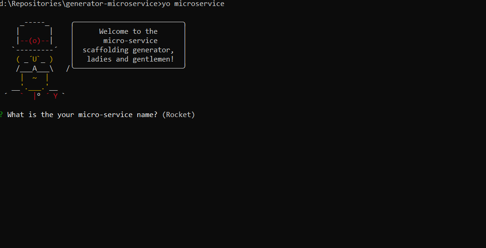

# generator-microservice 
[](#contributing)
> Yeoman generator for building .NET Core microservices

## 🚀 Installation and running

First, install [Yeoman](http://yeoman.io) (we assume you have pre-installed [node.js](https://nodejs.org/)).

```bash
npm install -g yo
npm link
```

Then generate your new project:

```bash
yo microservice
```
Answer a few questions and you are ready to go!



## Getting To Know Yeoman
 * Yeoman has a heart of gold.
 * Yeoman is a person with feelings and opinions, but is very easy to work with.
 * Yeoman can be too opinionated at times but is easily convinced not to be.
 * Feel free to [learn more about Yeoman](http://yeoman.io/).

## 🤝 Contributing
1. Fork it ( https://github.com/OKTAYKIR/generator-microservice/fork )
2. Create your feature branch (`git checkout -b my-new-feature`)
3. Commit your changes (`git commit -am 'Add some feature'`)
4. Push to the branch (`git push origin my-new-feature`)
5. Create a new Pull Request

## Show your support
Please ⭐️ this repository if this project helped you!

## 📝 License

Apache-2.0 © [Oktay Kır](https://www.linkedin.com/in/oktay-kır-phd-9402955a)